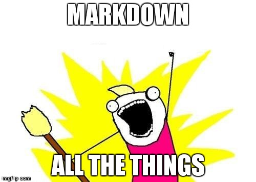

##Inline code
Pour désigner un mot ou une phrase comme code,placez-le entre guillemets (`).

**Cela se présente de cette manière :**
    `
 j'écris mon code 
` 

## Comment ajouter une image avec markdown ? 

**L'ajout d'image se fait simplement de cette façon :**

![image alt]
(cheminVersImage/nomImage.extention)

>Notez que si votre image ce trouve au même niveau que votre document, il n'est pas nécessaire de préciser le chemin. 